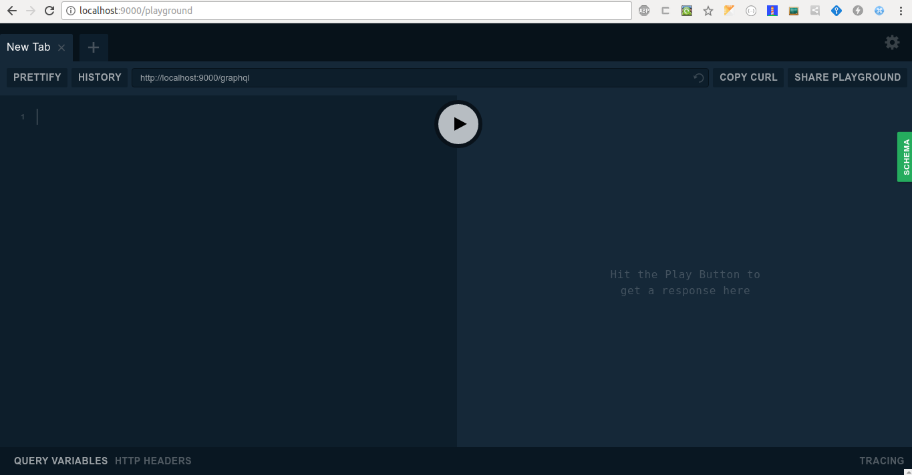

## Description

Starter for a Nest GraphQL Server w/ TypeScript

## Installation

```bash
yarn install
# or
npm install
```

## Start

```bash
yarn start
# or
npm run start
```

Open url: http://localhost:9000/playground



## Environments

Environments are located in file `.env`.

## Links

- https://github.com/nestjs/nest
- https://github.com/apollographql/apollo-server

## License

[MIT license](LICENSE).

